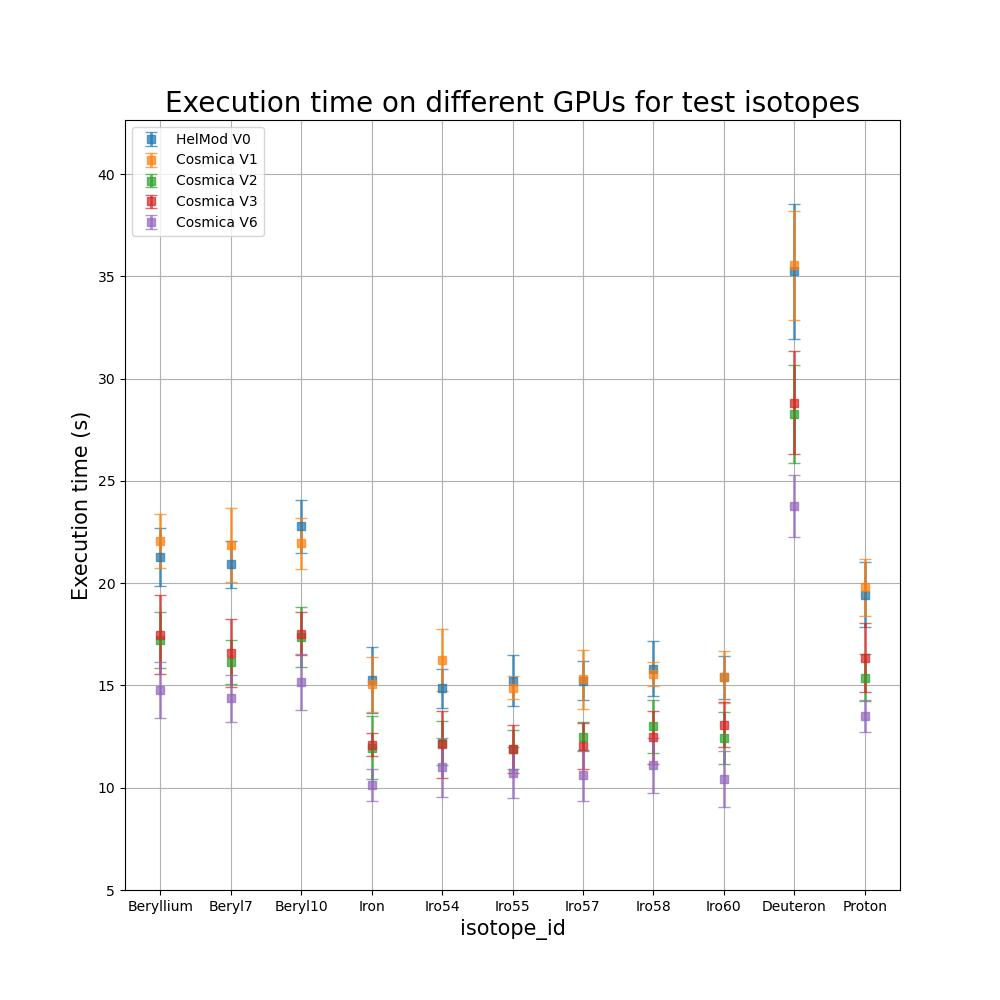
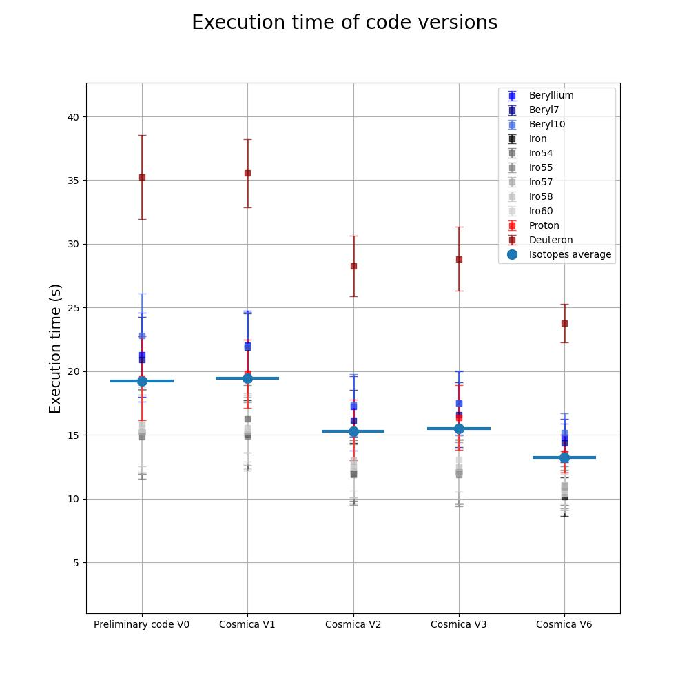
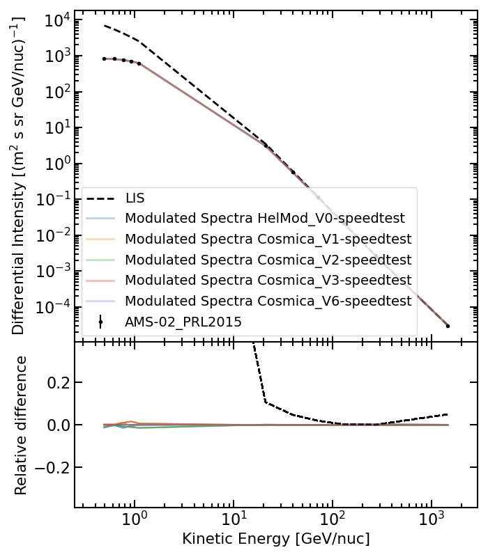

# COSMICA Develpment folder

Contains:

- the folders of code versions with following optimizations
- The performance plot with a test sample of ions and 5 even distributed input energies

(The test are run on NVIDIA A30 board for benchmark consistency)

## Version history

- V1 Milestone 7 version of the code
  - Use of struct of arrays instead of array of structs (synchronous broadcasting of memory access)
  - Number of simulated variables is rounded to fufill the warps
  - propagation variables allocated in shared memory
  - Search of the partial block histograms maximum inside propagation kernel
- V2 Improving internal structure
  - USage of customized compilation flags to reduce register compilation allocation
  - Implementation of the best Warp number per block derived from performance tests executed on A30 and A40 NVIDIA boards
- V3 Optimization of stochastic computations
  - Optimization of partial computations of the stochastic differential equations coefficients
  - Reduction of the allocated variables lightening overstructures
- V6 Use of the rigidity as main variable instead of kinetic energy
  - Reformulatino of SDE in momentum form (one of whcih becomes trivial)

## etst simulation set
| Element   | Ions                                                   | Initial Simulation Date | Final Simulation Date | Initial position |
|-----------|--------------------------------------------------------|-------------------------|-----------------------|------------------|
| Proton    | Proton  Deuterium                                   | 19-05-2011              | 26-11-2013            | Earth            |
| Beryllium | Beryllium  Beryl7  Beryl10                       | 19-05-2011              | 26-05-2016            | Earth            |
| Iron      | Iron  Iro54  Iro55  Iro57  Iro58  Iro60 | 19-05-2011              | 01-11-2019            | Earth            |

Beryllium
20110519
20160526
Iron
20110519
20191101
Proton
20110519
20131126

## Performance

All performance indicators are evalueted in 'SimTimePlot_speedup.ipynb'

- Performance benchmark on A30 GPUs board

- Precision convergence test (Proton simulation)
)

## Cosmica 1D model
Here there are the codes and building scripts of the Cosmica 1D model of Cosmic Rays (CR) propagation in the heliosphere.
These are the simplified version of the Cosmica code, which is 2D in modelling and 3D in propagation. The main algorithm is mantaine, but the propagation and implementation is reduced to its essential 1D components.
This version of the model can be taken as toy model to understand the algorithm and perfor some test or start to develop a different physical propagation model.

### Folder structure
- Trivial_1D-en: base 1D algorithm with the propagation formulation written in energy units
- Trivial_1D-rigi: base 1D algorithm with the propagation formulation written in rigidity units
- Cosmica_1D-en: Cosmica code in its semplified 1D formulation written in energy units
- Cosmica_1D-rigi: Cosmica code in its semplified 1D formulation written in rigidity units

- DataTXT: input ion propagation test data (Protons, Positrons)

- 0_OutputFiles_1D: heliosphere input parameters for all the available periods

- CreateInputFiles_FromSimulationList_AMS_gen_test.py: Script to create input file and initialize simulations runs starting from Simulations_test.list (list of simulations to test the codes for significant periods and Proton, Positions Ion samples)

- Analisi: Scripts for the evaluation of the propagation outputs and plots of the modulation results

### Execution
The execution of the Cosmica_1D follow the subsiquent pipeline:
1. Execute CreateInputFiles_FromSimulationList_AMS_gen_test.py to generate the inputfile and the bash AllRuns to execute the simulation list (pay attention on the correctness of the paths used in the scripts, they could have to be corrected to your corresponding local paths)
2. Launch the AllRuns.sh command for the desired code to be executed (all simulation list will be runned and added to the previous in the folder)
3. Run EvaluateSimulationResult.py to generate the whole modulation output (inside Analisi folder)
4. Run EvaluateFlux.py to compute the fluxe and plot the results of the desired code versions (inside Analisi folder)

### 1D model test run
- Ion: Proton
- Initial Simulation Date: 19/05/2013
- Final Simulation Date: 26/11/2013
- Initial position (Earth):
  - Radial Position: 1
  - Lat. Position: 0
  - Long. Position: 0
