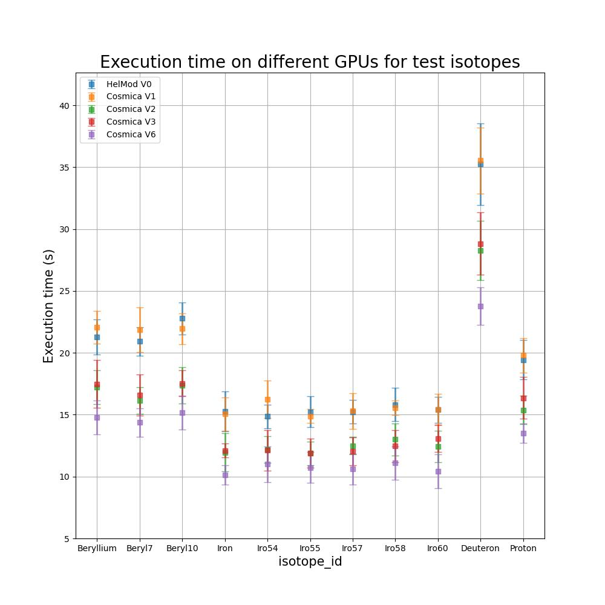
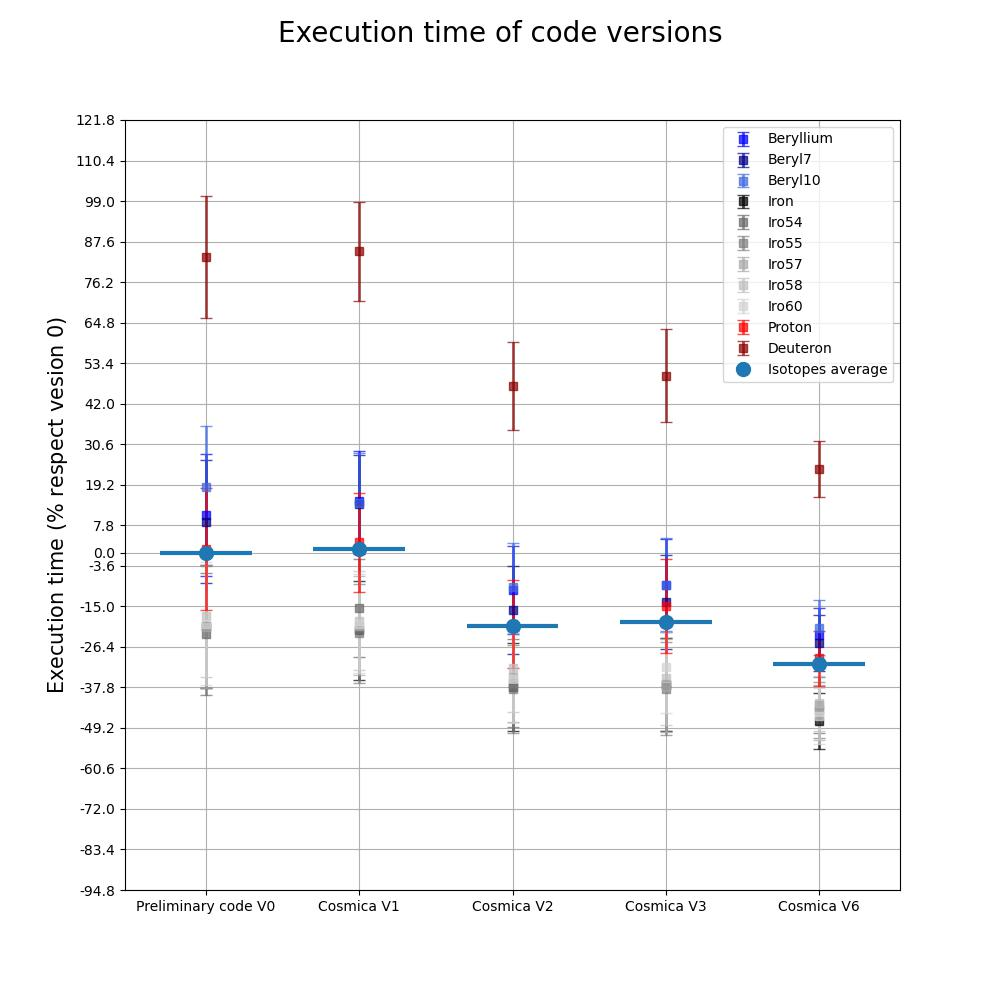
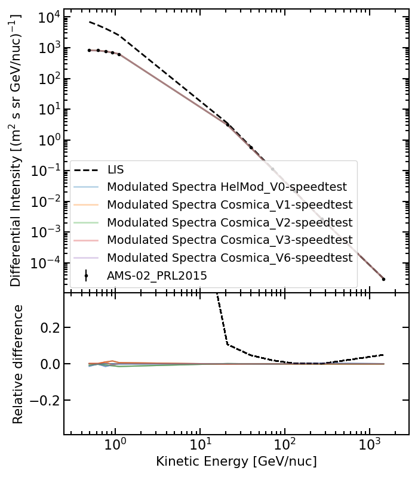

# COSMICA Development folder

## Description

COde for a Speedy Montecarlo Involving Cuda Architecture (COSMICA) is a speedy and high precision Monte Carlo simulator of Cosmic Rays (CR) modulation, which solve the system of Stochastic Differential Equations (SDE) equivalent to the Parker Transport Equation (PTE). A sample of independent virtual particles is stochastically propagated backward in time through the heliosphere, from the detection position to the external boundary. GPU parallelization of COSMICA code is a extremely useful for this task, because it strongly reduces the computational time for a standard simulation from hours to a few minutes. Moreover, COSMICA can distribute the computations over clusters of machines equipped with multiple GPUs, opening the way for further scaling.

## How to run the latest version
Cosmica V8 is the latest version of the code.
It features a new compilation system based on CMake, and new input-outputs format, easier to work with.
To run an example of code, follow these steps.

### Manual Compilation

From the `Cosmica_V8-speedtest` directory, run the following instructions:
```shell
cmake -S . ./build -DCMAKE_CUDA_ARCHITECTURES=86
cmake --build ./build --target Cosmica -- -j 10
```
This step will create an executable file named `Cosmica` in the folder `build`.
For Compute Capabilities different from 8.6 change the value in the first command.

The main requirements for COSMICA are CUDA 12.9 drivers and CMake 3.30+.

### Docker

An alternative to manual compilation is usage with docker.
This approach requires the NVIDIA Container Toolkit, that must be installed to leverage the GPUs available on the host machine.
To configure it, simply run the script `Cosmica_V8-speedtest/build_docker.sh`.
The default compiler is CC 8.0; to ensure optimal performance, check that your GPU is present in the list in the script, and eventually add it manually.
To run Cosmica built with docker, use the script `Cosmica_V8-speedtest/launch_docker.py` which automatically maps the paths of the files in the arguments from the host to the container.
The docker version accepts the same arguments as the normal compiled code, which are described below.

### Arguments

| Argument Name     | Optional | Description                                                                           |
|-------------------|-----------|---------------------------------------------------------------------------------------|
| `-i`, `--input`   | Yes       | Path of the input configuration file (`.yaml` or `.txt`).                              |
| `-o`, `--output_dir` | Yes    | Path of the output directory, ending with "/".                                        |
| `-v`, `--verbosity` | Yes     | Verbosity options (from most to least): trace, debug, info, warn, err, critical, off. |
| `--log_file`      | Yes       | Logs destination instead of stdout.                                                   |
| `--stdin`         | Yes       | Use stdin for input (YAML only). Input file is ignored.                               |
| `--stdout`        | Yes       | Use stdout for output (YAML only). This disables stdout logging.                      |
| `--legacy`        | Yes       | Use legacy `.txt` input and `.dat` output.                                            |
| `--no_pid`        | Yes       | Don't append the process ID to the output file.                                       |

### Example input
In order to run a simulation, the user must provide a YAML file with the configuration of the simulation.
This contains the particle information, the rigidity values, the particle source positions, the heliosphere parameters (both dynamic and static).
An example YAML file is formatted as follows:
```yaml
# The random seed is used to have reproducible simulations. On the same machine, two simulations with equal random seed will produce identical results, if omitted the simulation is random
random_seed: 72
# The path of the output files
output_path: proton_deuteron_20111116_20111212_4096_1_72
# The list of the output rigidities on which the simulation is run
rigidities: [1.08, 1.245, 1.42, 1.61, 1.815, 2.035, 2.275, 2.535, 2.82, 3.13, 3.465, 3.83, 4.225, 4.655, 5.125, 5.635, 6.185, 6.78, 7.425, 8.12, 8.87, 9.68, 10.55]
# The dictionary (name: info) of the isotopes to evaluate
isotopes:
  proton:
    nucleon_rest_mass: 0.938272
    mass_number: 1.0
    charge: 1.0
  deuteron:
    nucleon_rest_mass: 0.938272
    mass_number: 2.0
    charge: 1.0
# The source position backwards in time, if multiple are specified, they are evaluated in consecutive Carrington rotations (periods)
sources:
  r: [1.0]
  th: [1.5707963267948966]
  phi: [0.0]
# The size of the bins in the output histograms
relative_bin_amplitude: 0.00855
# The number of replicas of identical particles for each instance (with equal rigidity, dynamic parameters, isotope, period) 
n_particles: 4096
# The number of regions in which the heliosphere is subdivided
n_regions: 15
# The dynamic parameters are special parameters of which multiple sets can be specified, and they will all be run at the same time.
# It is equivalent to running separate sequential simulations, with different parameters, but it improves the performance of the simulation,
# as it saturates the GPU better
# If multiple parameters are not required, just specify a single row
dynamic:
  heliosphere: # At the moment only heliosphere dynamic parameters are supported
    # In this example, two sets of k0 values are specified, one using the value 0.002 in the first zone, and the other using 0.003
    # For the field k0, the value 0.0 indicates that the simulation uses a deterministic heuristic, based on the static parameters, to estimate the k0 value
    # The length of each row is determined by "n_regions + len(sources) - 1" as it represents the heliosphere during the entire propagation
    k0:
    - [0.0002, 0.0, 0.0, 0.0, 0.0, 0.0, 0.0, 0.0, 0.0, 0.0, 0.0, 0.0, 0.0, 0.0, 0.0]
    - [0.0003, 0.0, 0.0, 0.0, 0.0, 0.0, 0.0, 0.0, 0.0, 0.0, 0.0, 0.0, 0.0, 0.0, 0.0]
# The static parameters are fixed of all simulations of this file. They are subdivided in heliosphere and heliosheat.
# For the heliosphere, the length of each row is determined by "n_regions + len(sources) - 1", like for the dynamic parameters
# For the heliosheat, which is composed of just one zone, the length of each row is just "len(sources)"
static:
  heliosphere:
    ssn: [92.387, 89.414, 88.052, 88.193, 88.628, 85.615, 78.704, 69.687, 61.436, 54.558, 49.942, 47.34, 45.357, 42.635, 38.213]
    v0: [384.0, 363.3, 410.04, 426.3, 455.11, 464.81, 451.89, 435.44, 441.78, 416.11, 435.26, 381.93, 427.93, 381.75, 402.96]
    tilt_angle: [66.9, 69.6, 71.1, 66.7, 67.1, 64.5, 63.5, 63.7, 69.9, 65.2, 56.1, 53.6, 48.2, 48.8, 40.4]
    smooth_tilt: [66.142, 66.617, 67.408, 67.008, 66.092, 64.825, 63.267, 61.533, 58.975, 57.042, 55.583, 53.642, 52.15, 49.167, 46.442]
    b_field: [5.059, 5.741, 5.725, 5.096, 5.007, 5.281, 5.575, 5.356, 4.863, 5.986, 5.656, 4.541, 4.659, 4.246, 4.937]
    polarity: [-1.0, -1.0, -1.0, -1.0, -1.0, -1.0, -1.0, -1.0, -1.0, -1.0, -1.0, -1.0, -1.0, -1.0, -1.0]
    solar_phase: [0.0, 0.0, 0.0, 0.0, 0.0, 0.0, 0.0, 0.0, 0.0, 0.0, 0.0, 0.0, 0.0, 0.0, 0.0]
    nmcr: [274.307, 270.473, 271.815, 274.32, 274.113, 272.754, 272.504, 273.648, 276.23, 268.111, 272.785, 281.366, 279.909, 276.43, 279.955]
    ts_nose: [72.55, 72.19, 71.8, 71.4, 70.95, 70.57, 70.23, 69.84, 69.42, 69.05, 68.69, 68.37, 68.13, 67.91, 67.72]
    ts_tail: [77.97, 77.52, 77.05, 76.58, 76.08, 75.63, 75.23, 74.74, 74.27, 73.86, 73.48, 73.25, 73.06, 72.89, 72.78]
    hp_nose: [125.31, 126.24, 127.1, 127.99, 128.82, 129.66, 130.48, 131.2, 131.92, 132.57, 133.19, 133.83, 134.43, 135.04, 135.67]
    hp_tail: [140.29, 141.22, 142.04, 142.78, 143.42, 143.99, 144.52, 145.03, 145.53, 146.09, 146.62, 147.19, 147.78, 148.38, 148.96]
  heliosheat:
    k0: [3.0e-05]
    v0: [402.96]
```

### Running benchmarks
To run the benchmark set from the paper, run the script `Cosmica_V8-speedtest/test/benchmark/make_inputs.py` which generates all the inputs in the folders `Cosmica_V8-speedtest/test/data/benchmark/*`, followed by the script `Cosmica_V8-speedtest/test/benchmark/run_tests.py`.
Modify the second script to choose which benchmarks to run, as the entire set is extremely large.


## License

Distributed under the GNU Affero General Public License v3.0 License. See [LICENSE](https://github.com/ICSC-Spoke3/Cosmica-dev/blob/main/LICENSE) for more information.

## Contains:

- the folders of code versions with following optimizations
- The performance plot with a test sample of ions and 5 even distributed input energies

(The test are run on NVIDIA A30 board for benchmark consistency)

## Version history

- V1 Milestone 7 version of the code
  - Use of struct of arrays instead of array of structs (synchronous broadcasting of memory access)
  - Number of simulated variables is rounded to fulfill the warps
  - propagation variables allocated in shared memory
  - Search of the partial block histograms maximum inside propagation kernel
- V2 Improving internal structure
  - Usage of customized compilation flags to reduce register compilation allocation
  - Implementation of the best Warp number per block derived from performance tests executed on A30 and A40 NVIDIA boards
- V3 Optimization of stochastic computations
  - Optimization of partial computations of the stochastic differential equations coefficients
  - Reduction of the allocated variables lightening superstructures
- V6 Use of the rigidity as main variable instead of kinetic energy
  - Reformulation of SDE in momentum form (one of which becomes trivial)
- V7 (under development) Separation of SDE coefficients computation for each coordinate
  - Instead of using matrices of coefficients, they are computed separately to relieve the register pressure

## Test simulation set

| Element   | Ions                                                   | Initial Simulation Date | Final Simulation Date | Initial position |
|:---------:|:------------------------------------------------------:|:-----------------------:|:---------------------:|:----------------:|
| Proton    | Proton<br> Deuterium                                   | 19-05-2011              | 26-11-2013            | Earth            |
| Beryllium | Beryllium<br> Beryl7<br> Beryl10                       | 19-05-2011              | 26-05-2016            | Earth            |
| Iron      | Iron<br> Iro54<br> Iro55<br> Iro57<br> Iro58<br> Iro60 | 19-05-2011              | 01-11-2019            | Earth            |

## Performance

All performance indicators are evaluated in 'SimTimePlot_speedup.ipynb'

- Performance benchmark on A30 GPUs board



- Precision convergence test (Proton simulation)
)

## COSMICA 1D model
The Cosmica-1D directory contains the source code and building scripts for the COSMICA 1D model of CRs propagation in the heliosphere.
These are the simplified version of the COSMICA code, which is 2D in modelling and 3D in propagation. The main algorithm is maintained, but the propagation and implementation is reduced to its essential 1D components.
This version of the model can be taken as toy model to understand the algorithm and perform some test or start to develop a different physical propagation model.

### Folder structure
- Trivial_1D-en: base 1D algorithm with the propagation formulation written in energy units
- Trivial_1D-rigi: base 1D algorithm with the propagation formulation written in rigidity units
- Cosmica_1D-en: COSMICA code in its simplified 1D formulation written in energy units
- Cosmica_1D-rigi: COSMICA code in its simplified 1D formulation written in rigidity units

- DataTXT: input ion propagation test data (Protons, Positrons)

- 0_OutputFiles_1D: heliosphere input parameters for all the available periods

- CreateInputFiles_FromSimulationList_AMS_gen_test.py: Script to create input file and initialize simulations runs starting from Simulations_test.list (list of simulations to test the codes for significant periods and Proton, Positions Ion samples)

- Analisi: Scripts for the evaluation of the propagation outputs and plots of the modulation results

### Execution
The execution of the Cosmica_1D follow the subsequent pipeline:
1. Execute CreateInputFiles_FromSimulationList_AMS_gen_test.py to generate the input file and the bash AllRuns to execute the simulation list (pay attention on the correctness of the paths used in the scripts, they could have to be corrected to your corresponding local paths)
2. Launch the AllRuns.sh command for the desired code to be executed (all simulation list will be run and added to the previous in the folder)
3. Run EvaluateSimulationResult.py to generate the whole modulation output (inside Analisi folder)
4. Run EvaluateFlux.py to compute the fluxes and plot the results of the desired code versions (inside Analisi folder)

### 1D model test run
- Ion: Proton
- Initial Simulation Date: 19/05/2013
- Final Simulation Date: 26/11/2013
- Initial position (Earth):
  - Radial Position: 1
  - Lat. Position: 0
  - Long. Position: 0

## Acknowledgement

This activity is supported by Fondazione ICSC, Spoke 3 Astrophysics and Cosmos Observations. National Recovery and Resilience Plan (Piano Nazionale di Ripresa e Resilienza, PNRR) Project IDCN00000013.MG, SDT and GLV are supported by INFN and ASI under ASI-INFN Agreement No. 2019-19-HH.0 and its amendments.
