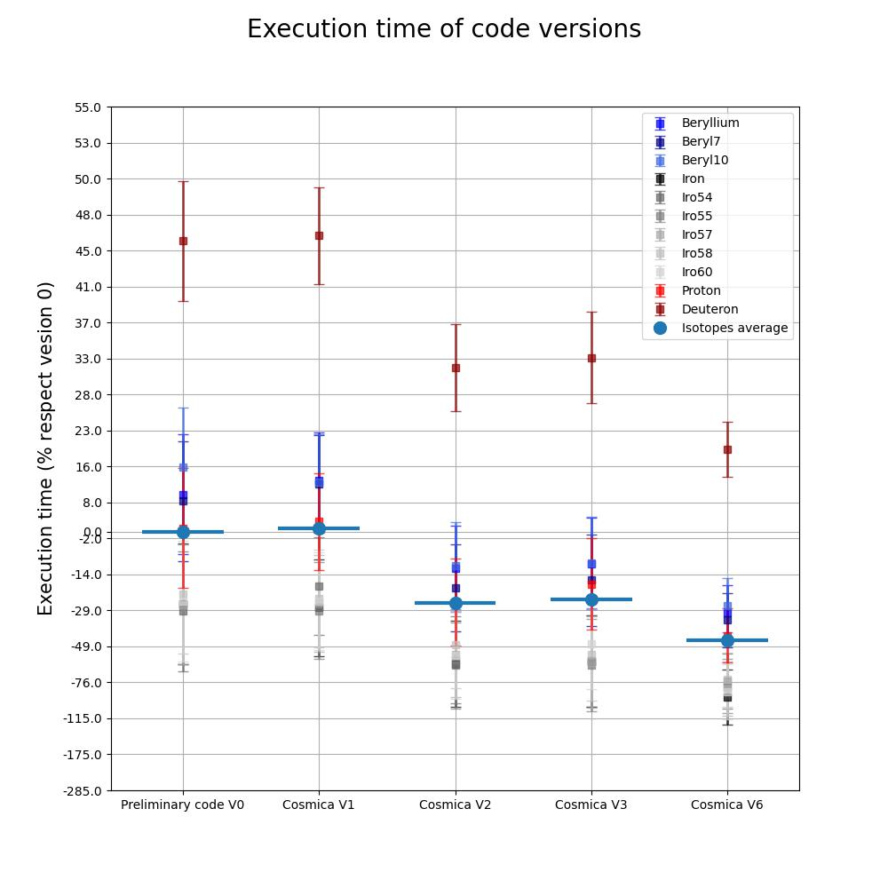

# COSMICA Development folder

## Description

COde for a Speedy Montecarlo Involving Cuda Architecture (COSMICA) is a speedy and high precision Monte Carlo simulator of CR modulation, which solve the system of Stochastic Differential Equations (SDE) equivalent to the Parker Transport Equation (PTE). A sample of virtual particles is independently stochastic propagated backward in time from the detection position through the heliosphere to the external boundary. GPU parallelization of COSMICA code is a game changer in this field because it improves the computational time for a standard simulation from order of hundred of minutes to few of them. Furthermore, the code is capable of distributing the computations on clusters of machines with multiple GPUs, opening the way for scaling.

## License

Distributed under the GNU Affero General Public License v3.0 License. See [LICENSE](https://github.com/ICSC-Spoke3/Cosmica-dev/blob/main/LICENSE) for more information.

## Contains:

- the folders of code versions with following optimizations
- The performance plot with a test sample of ions and 5 even distributed input energies

(The test are run on NVIDIA A30 board for benchmark consistency)

## Version history

- V1 Milestone 7 version of the code
  - Use of struct of arrays instead of array of structs (synchronous broadcasting of memory access)
  - Number of simulated variables is rounded to fulfill the warps
  - propagation variables allocated in shared memory
  - Search of the partial block histograms maximum inside propagation kernel
- V2 Improving internal structure
  - Usage of customized compilation flags to reduce register compilation allocation
  - Implementation of the best Warp number per block derived from performance tests executed on A30 and A40 NVIDIA boards
- V3 Optimization of stochastic computations
  - Optimization of partial computations of the stochastic differential equations coefficients
  - Reduction of the allocated variables lightening superstructures
- V6 Use of the rigidity as main variable instead of kinetic energy
  - Reformulation of SDE in momentum form (one of which becomes trivial)
- V7 (under development) Separation of SDE coefficients computation for each coordinate
  - Instead of using matrices of coefficients, they are computed separately to relieve the register pressure

## Test simulation set

| Element   | Ions                                                   | Initial Simulation Date | Final Simulation Date | Initial position |
|:---------:|:------------------------------------------------------:|:-----------------------:|:---------------------:|:----------------:|
| Proton    | Proton  Deuterium                                   | 19-05-2011              | 26-11-2013            | Earth            |
| Beryllium | Beryllium  Beryl7  Beryl10                       | 19-05-2011              | 26-05-2016            | Earth            |
| Iron      | Iron  Iro54  Iro55  Iro57  Iro58  Iro60 | 19-05-2011              | 01-11-2019            | Earth            |

## Performance

All performance indicators are evaluated in 'SimTimePlot_speedup.ipynb'

- Performance benchmark on A30 GPUs board

- Precision convergence test (Proton simulation)
)

## COSMICA 1D model
Here there are the codes and building scripts of the COSMICA 1D model of Cosmic Rays (CR) propagation in the heliosphere.
These are the simplified version of the COSMICA code, which is 2D in modelling and 3D in propagation. The main algorithm is maintained, but the propagation and implementation is reduced to its essential 1D components.
This version of the model can be taken as toy model to understand the algorithm and perform some test or start to develop a different physical propagation model.

### Folder structure
- Trivial_1D-en: base 1D algorithm with the propagation formulation written in energy units
- Trivial_1D-rigi: base 1D algorithm with the propagation formulation written in rigidity units
- Cosmica_1D-en: COSMICA code in its simplified 1D formulation written in energy units
- Cosmica_1D-rigi: COSMICA code in its simplified 1D formulation written in rigidity units

- DataTXT: input ion propagation test data (Protons, Positrons)

- 0_OutputFiles_1D: heliosphere input parameters for all the available periods

- CreateInputFiles_FromSimulationList_AMS_gen_test.py: Script to create input file and initialize simulations runs starting from Simulations_test.list (list of simulations to test the codes for significant periods and Proton, Positions Ion samples)

- Analisi: Scripts for the evaluation of the propagation outputs and plots of the modulation results

### Execution
The execution of the Cosmica_1D follow the subsequent pipeline:
1. Execute CreateInputFiles_FromSimulationList_AMS_gen_test.py to generate the input file and the bash AllRuns to execute the simulation list (pay attention on the correctness of the paths used in the scripts, they could have to be corrected to your corresponding local paths)
2. Launch the AllRuns.sh command for the desired code to be executed (all simulation list will be run and added to the previous in the folder)
3. Run EvaluateSimulationResult.py to generate the whole modulation output (inside Analisi folder)
4. Run EvaluateFlux.py to compute the fluxes and plot the results of the desired code versions (inside Analisi folder)

### 1D model test run
- Ion: Proton
- Initial Simulation Date: 19/05/2013
- Final Simulation Date: 26/11/2013
- Initial position (Earth):
  - Radial Position: 1
  - Lat. Position: 0
  - Long. Position: 0

## Acknowledgement

This activity is supported by Fondazione ICSC, Spoke 3 Astrophysics and Cosmos Observations. National Recovery and Resilience Plan (Piano Nazionale di Ripresa e Resilienza, PNRR) Project IDCN00000013.MG, SDT and GLV are supported by INFN and ASI under ASI-INFN Agreement No. 2019-19-HH.0 and its amendments.
